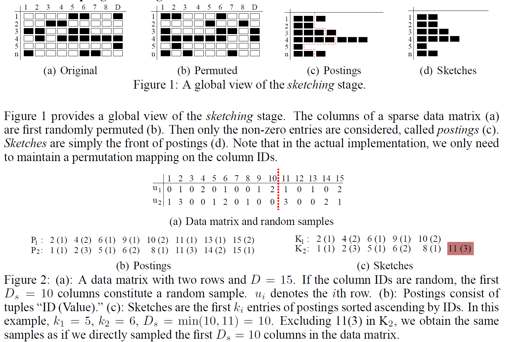
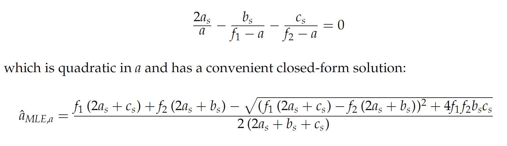

# Conditional Random Sampling (CRS), a.k.a. Smallest-K Sketch 

This line of work was started in 2004 at Microsoft Research. One obvoius application is to sample from the inverted indexes (postings). 

For sparse data, the inverted index is routinely used. To improve efficiency and storage, we directly sample the front of each inverted index vector, hence the name "Small-K Sketch" although the "K" does not need to be the same for each vector. In the estimation stage, for any pair (or any group) of sketches, we can retrospectively construct a uniform random sample for that pair (or group). With a random sample, one can use it to compute any similarities and summary statistics. Therefore, it is a "one-sketch-for-all" scheme. 

The drawback of this scheme is that the sample size differs for each pair (group) and hence it can not be used for directly building large-scale learning models and hash tables for sub-linear time approximate near neighbor search. On the other hand, there are plenty applications which can benefit from this method, for example, computing similarities within HNSW or during the re-ranking stage of ANN methods. 

## The sampling procedure (images from the NIPS 2006 paper) 

 

## The quadratic estimation formula (approximate MLE) for binary data

After we have obtained samples (a_s, b_s, c_s) using CRS, we estimate the original intersection a, by taking advnatage of the marginal information (f_1, f_2, i.e., lengths of the original postings) to solve a maximum likelihood equation which is a cubic equation and can be approximated as a quadratic equation: 

 

The above estimator (initially appeared in EMNLP 2005) is provably more accurate than the standard min-wise hashing estimator, very substantially so when data are un-balanced, i.e., one original posting is substantially shorter than the other. 

# The 2005 Words Dataset
The Words dataset contains 2,702 samples, and each instance is a word count in 2^16 different documents. In the other word, each data point is a 2^16 dimensional vector representing the number of occurrences of an English word in a repository of 2^16 documents. 
The word vectors are in the zipped file `words.zip`. Each file is a word vector in a two-column sparse representation: the first column is the vector value (the number of occurrences) and the second column is the vector index.

## Reference for the Words dataset
* Ping Li and Kenneth Church. [Using Sketches to Estimate Associations](https://aclanthology.org/H05-1089.pdf). EMNLP 2005.

## Recent Papers which used the 2005 Words dataset
* Xiaoyun Li and Ping Li. [C-MinHash: Improving Minwise Hashing with Circulant Permutation](https://proceedings.mlr.press/v162/li22m/li22m.pdf). ICML 2022.
* Xiaoyun Li and Ping Li. [Rejection Sampling for Weighted Jaccard Similarity Revisited](https://ojs.aaai.org/index.php/AAAI/article/view/16543/16350). AAAI 2021.

# References for Conditional Random Sampling (CRS) 
* Ping Li' PhD Thesis. [Stable random projections and conditional random sampling, two sampling techniques for modern massive datasets](https://hastie.su.domains/THESES/pingli_thesis.pdf)). Department of Statistics, Stanford University, 2007.
* Ping Li, Kenneth Church, Trevor Hastie. [One Sketch For All: Theory and Application of Conditional Random Sampling](https://proceedings.neurips.cc/paper/2008/file/fe7ee8fc1959cc7214fa21c4840dff0a-Paper.pdf). NIPS 2008.
* Ping Li, Kenneth Church. [A Sketch Algorithm for Estimating Two-Way and Multi-Way Associations](https://aclanthology.org/J07-3003.pdf). Computational Linguistics 2007.
* Ping Li, Kenneth Church, Trevor Hastie. [Conditional Random Sampling: A Sketch-based Sampling Technique for Sparse Data](https://proceedings.neurips.cc/paper/2006/file/aa6b7ad9d68bf3443c35d23de844463b-Paper.pdf). NIPS 2006.
* Ping Li, Kenneth Church. [Using Sketches to Estimate Associations](https://aclanthology.org/H05-1089.pdf). EMNLP 2005.
